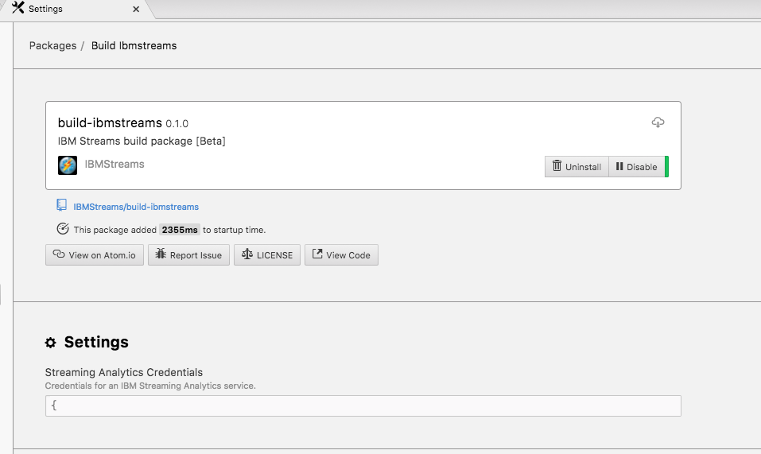
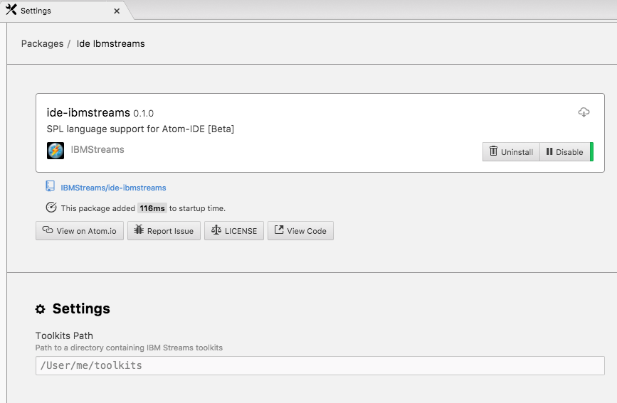
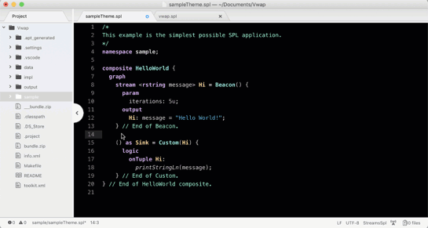
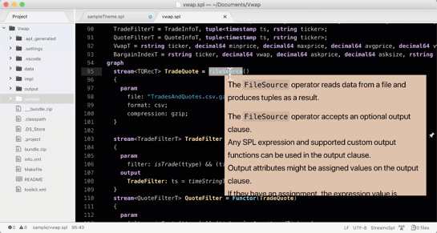
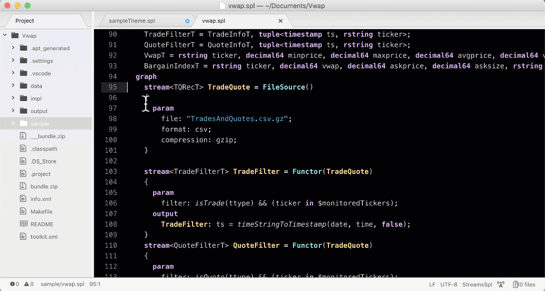
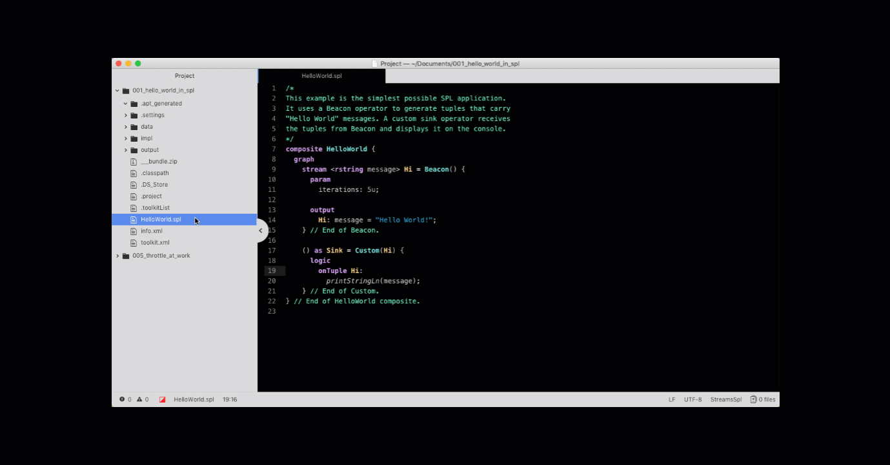

# ide-ibmstreams [Beta]
IBM Streams support for Atom-IDE using the IBM Streams SPL langauge server.

### Beta
This is the initial public release.  For best results should also install these Atom packages:
* language-ibmstreams-spl
* streams-dark-syntax
* streams-light-syntax
* atom-ide-ui
* build-ibmstreams

### Setup Instructions
#### Build - Streaming Analytics Credentials
The <b>build-ibmstreams</b> package requires a running IBM Streaming Analytics service. SPL applications will be built and deployed on this service. If you need to create one, start <a href="https://console.bluemix.net/catalog/services/streaming-analytics" rel="noopener" target="_blank">here</a> and follow the instructions to create an account.

Once you have an account go to your <a href="https://console.bluemix.net/dashboard/apps" rel="noopener" target="_blank">dashboard</a> and select the Streaming Analytic service you want to use. You need to make sure it is running and then copy your credentials to the clipboard. To get your credentials select <b>Service Credentials</b> from the actions on the left. From the credentials page, press <b>View credentials</b> for the one you want to use and press the copy button in the upper right side of the credentials to copy them to the clipboard.

In Atom there is a setting in the <b>build-ibmstreams</b> package for the credentials. Go to <b>Atom->Preferences->Packages</b> and press the <b>Settings</b> button on the <b>build-ibmstreams</b> package and paste your credentials into the setting.

#### Toolkit Folder
The <b>ide-ibmstreams</b> package includes support for all the product toolkits. If you use any other toolkits in your application those toolkits need to be downloaded to your workstation and all placed within a single folder. The toolkit path setting needs to be set to your toolkit folder’s path. To do that:
<b>Atom->Preferences->Packages</b>, find the <b>ide-ibmstreams</b> package and press <b>Settings</b> button. In the Toolkits Path setting put the fully qualified path name of the folder that you placed all the toolkits in.

### Features
The following are some of the fetaures shown using the streams-dark-syntax theme.
#### Code Completion

#### Data tips (Hover support)

#### Code Folding

#### SPL Application build

